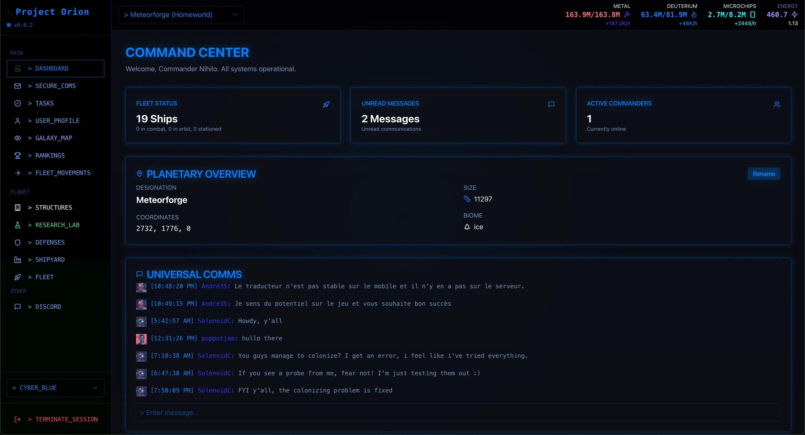

# 🎮 Project Orion - Frontend

This is the frontend application for Project Orion, built with Next.js. It provides an immersive user interface for our space strategy MMO game, featuring real-time 3D visualizations, interactive galaxy maps, and seamless multiplayer interactions.



## 🛠️ Tech Stack

- **Framework**: Next.js 13+ with App Router
- **UI Libraries**:
  - React 18
  - Radix UI primitives
  - Shadcn UI components
  - Tailwind CSS
- **3D Rendering**:
  - Three.js / React Three Fiber
  - GSAP for animations
- **State Management**:
  - Zustand
  - React Query
- **Real-time Communication**:
  - Socket.IO
  - WebSocket
- **Authentication**:
  - Firebase Authentication
- **Development**:
  - TypeScript
  - ESLint
  - Prettier

## 🚀 Getting Started

### Prerequisites

- Node.js 18+
- npm or yarn
- Running instance of the backend server

### Installation

1. Clone the repository and navigate to the client directory:
```bash
git clone https://github.com/nihiloproxima/project-orion.git
cd project-orion/client
```

2. Install dependencies:
```bash
npm install
```

3. Create a `.env.local` file with your configuration:
```env
NEXT_PUBLIC_API_URL=http://localhost:40001/
NEXT_PUBLIC_WEBSOCKET_URL=http://localhost:8080/
NEXT_PUBLIC_FIREBASE_API_KEY=your_api_key_here
NEXT_PUBLIC_FIREBASE_AUTH_DOMAIN=your_project_id.firebaseapp.com
NEXT_PUBLIC_FIREBASE_PROJECT_ID=your_project_id
NEXT_PUBLIC_FIREBASE_STORAGE_BUCKET=your_project_id.firebasestorage.app
NEXT_PUBLIC_FIREBASE_MESSAGING_SENDER_ID=your_sender_id
NEXT_PUBLIC_FIREBASE_APP_ID=your_app_id
```

4. Start the development server:
```bash
npm run dev
```

Open [http://localhost:3000](http://localhost:3000) with your browser to see the result.

## 📦 Project Structure

- `app/` - Next.js App Router pages and components
- `components/` - Reusable React components
- `lib/` - Utility functions and helpers
- `styles/` - Global CSS styles
- `types/` - TypeScript type definitions
- `public/` - Static assets


## 🎮 Game Features

- **3D Galaxy Map**:
  - Interactive star system navigation
  - Real-time fleet movement visualization
  - Dynamic zoom and rotation controls
  
- **Resource Management**:
  - Real-time resource production tracking
  - Building queue management
  - Research and development interface
  
- **Fleet Command**:
  - Ship construction and management
  - Mission planning and execution
  - Combat visualization

- **Colony Management**:
  - Resource extraction and processing
  - Building construction and upgrades
  - Research and technology tree
  
- **Social and Trading**:
  - Player-to-player trading
  - Alliance and guild systems
  - Global chat and communication
